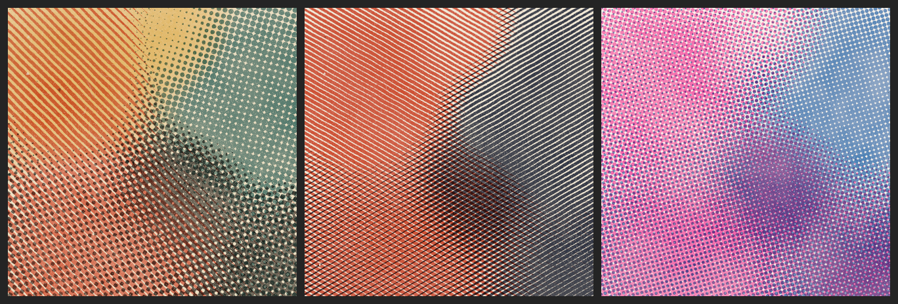
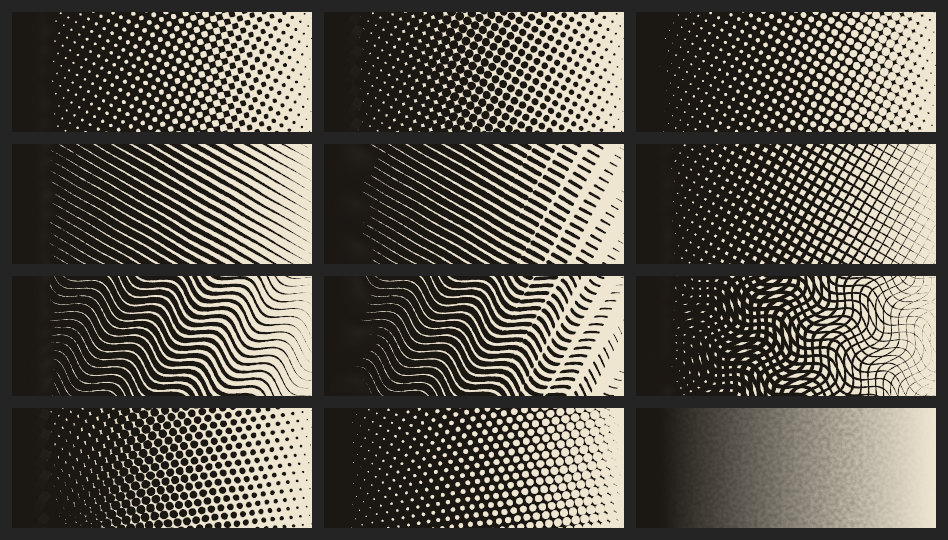
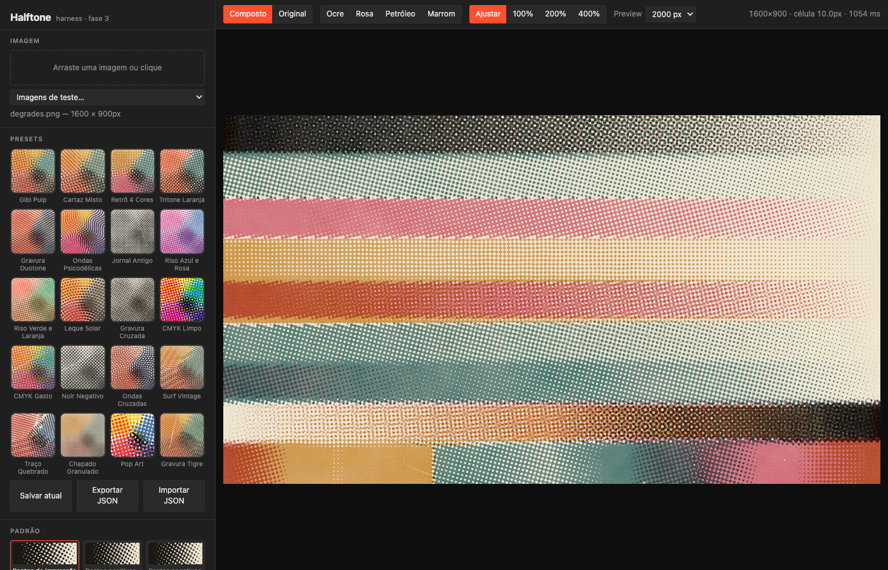

# Halftone Tool

Motor de halftone de impressão real para um plugin de Photoshop (UXP). Transforma uma imagem em retícula como se tivesse sido impressa: tintas customizadas que se misturam como tinta de verdade, 12 padrões de retícula com aspecto orgânico, envelhecimento (papel, fibras, poeira, desregistro) e separação em chapas.



> Em desenvolvimento. Hoje o motor e o harness de teste no navegador estão prontos (fases 1 a 3). O plugin do Photoshop vem a seguir.

## O que já faz

**Padrões de retícula.** São 12 padrões. Cada tinta pode usar um padrão diferente na mesma imagem (ex.: pontos + linhas + chapado).



| | | |
|---|---|---|
| Pontos de impressão | Pontos positivos | Pontos negativos |
| Linhas | Linhas quebradas | Linhas cruzadas |
| Ondas | Ondas quebradas | Ondas cruzadas |
| Leque | Leque negativo | Tinta chapada |

**Aspecto orgânico.** Rugosidade da borda e distorção da grade, com seed fixa: mesmas configurações dão sempre o mesmo resultado.

**Tintas customizadas.**
- **Color match:** escolha quantas tintas quiser, em qualquer cor, e o motor calcula quanto de cada uma reproduz a imagem original.
- **CMYK clássico:** com geração de preto (GCR).
- **Como tinta real:** as tintas se sobrepõem de forma subtrativa (amarelo sobre ciano = verde) e na ordem de impressão.
- **Por tinta:** cada tinta tem sua própria força e pode ser opaca. O papel pode ter qualquer cor.

**Envelhecimento.** Textura do papel, fibras, poeira e arranhões, desbotamento da tinta, desregistro entre chapas e ganho de ponto. Tudo é procedural e desligado por padrão.

**20 presets.** Cada um tem miniatura visual. Também dá para salvar, exportar e importar presets em JSON.

**Qualidade.**
- Anti-aliasing analítico, sem serrilhado e sem ponto cortado na borda da célula.
- Filtro contra moiré proporcional à célula.
- Tom calibrado na escala do pixel: o tom médio fica certo em qualquer tamanho de célula, com erro abaixo de 2 níveis em 255, o que o teste automático confere.

**Saídas.** PNG composto e uma chapa por tinta (preto sobre branco), na resolução total.



## Como rodar o harness

Precisa só do macOS (ou qualquer sistema com Python 3) e de um navegador.

- **No Finder:** duplo clique em `harness/abrir-harness.command`.
- **Pelo terminal**, na pasta do projeto:

```bash
python3 -m http.server 8765
# abra http://localhost:8765/harness/
```

O servidor local é necessário porque o navegador não roda Web Workers direto de `file://`.

## Testes

```bash
npm test               # precisão de tom de todos os padrões (roda em qualquer sistema)
npm run test:imagens   # também renderiza as imagens de /test-images (macOS, usa o sips)
```

Sem dependências: só Node 18+.

## Usando o motor

O motor é JavaScript puro, sem DOM, sem canvas e sem Photoshop. O mesmo código roda no navegador, em Web Worker, no Node e no UXP.

```js
const HT = require('./engine');

const result = HT.render(
  { width, height, data, channels: 4 },      // buffer RGBA 8 bits
  {
    cellSize: 10,
    pattern: 'print',
    roughness: 0.4,
    paper: '#EFE6D2',
    separation: { mode: 'solve' },
    inks: [
      { id: 'a', color: '#E8642C', angle: 15 },
      { id: 'b', color: '#1E6B73', angle: 75, pattern: 'lines' },
      { id: 'c', color: '#2A211D', angle: 45 },
    ],
    aging: { paper: 0.5, fibers: 0.3, dust: 0.2 },
    plates: true,
  }
);
// result.data   -> RGBA composto
// result.plates -> uma chapa (cinza) por tinta
```

Todas as opções e seus valores padrão estão em `defaultSettings()` em [engine/halftone.js](engine/halftone.js).

No navegador, carregue os arquivos de `engine/` na ordem de [harness/worker.js](harness/worker.js) e use o objeto global `HT`.

## Estrutura

```
engine/        motor do halftone (JS puro)
  color.js       sRGB <-> luz linear, curva de entrada
  separation.js  separação de cor para N tintas (mínimos quadrados, tabela 3D)
  dots.js        formatos (SDF) e calibração tamanho <-> área
  patterns.js    catálogo de padrões (formato + grade + negativo)
  raster.js      desenho com anti-aliasing e calibração na escala do pixel
  aging.js       envelhecimento (papel, fibras, poeira, desbotamento...)
  noise.js       ruído com seed
  presets.js     presets de referência
  halftone.js    o render completo
  test/          testes e geradores de cartelas/imagens
harness/       página de teste no navegador
plugin/        plugin UXP do Photoshop (próxima fase)
test-images/   imagens de teste
docs/          imagens deste README (npm run imagens-readme)
```

O código da lógica do halftone é comentado em português.

## Roteiro

- [x] **Fase 1:** motor + harness (CMYK, anti-aliasing, sem moiré)
- [x] **Fase 2:** 12 padrões, aspecto orgânico, tintas customizadas
- [x] **Fase 3:** envelhecimento + presets
- [ ] **Fase 3.5:** produção têxtil (DTF/serigrafia): remover fundo preto/branco da camisa, base branca, limite de tinta, ponto mínimo/máximo
- [ ] **Fase 4:** plugin UXP no Photoshop (aplicar na camada selecionada)
- [ ] **Fase 5:** efeito "vivo" (Smart Object, reeditável depois)
- [ ] **Fase 6:** chapas, 16 bits, documentos CMYK, otimização

## Créditos

Criado por Danilo Mariani. Inspirado nas *funcionalidades* do Retratone (Texturelabs). Todo o código foi escrito do zero a partir de técnicas de impressão de domínio público; o projeto não tem nenhuma relação com a Texturelabs.

Todos os direitos reservados.
